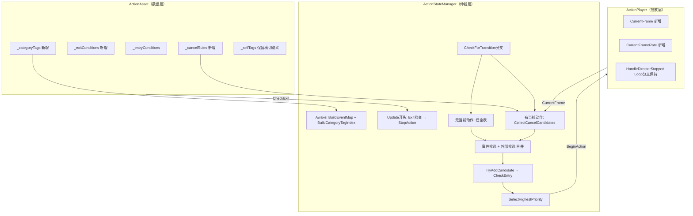

## Product Overview
重构 CombatSample 的 Action 仲裁系统：将原有的 `Branches`（无窗口的派生动作列表）升级为**基于帧数的 CancelRule 机制**，并引入 **ExitConditions** 让动作能自愿退出，解决三个遗留问题：
1. Locomotion 松手后无法切回 Idle（ExitConditions 解决）
2. 普攻连段无法按帧窗口派生分支（CancelRule + CancelWindow 解决）
3. Tag 承担"分类/派生"语义模糊（新增 `_categoryTags` 做分类归属，`_selfTags` 回归横切运行态语义）

## Core Features
- **CancelWindow**：以帧数（int）为唯一时间计量的取消窗口，`startFrame` / `endFrame`（-1 表示开放到结束）
- **CancelRule**：两种目标类型——`SpecificAction`（直接指向一个 Action）或 `AnyWithTag`（匹配所有带某分类 Tag 的 Action）
- **ExitConditions**：与 EntryConditions 对称的"自愿退出条件"，复用现有 `overrideAll` / `invertResult` 语义
- **CategoryTags**：新增 ActionAsset 字段，标记动作分类归属（如 LightAttack / Skill / Dodge），供 `AnyWithTag` 匹配，不写入任何运行态容器
- **ActionPlayer.CurrentFrame**：基于 `_director.time × frameRate` 实时计算的帧号，HitStop 时自然冻结
- **ASM 仲裁分叉**：无当前动作时扫全表寻找入场者；有当前动作时只从 CancelRules 派生候选；事件/外部候选两种情况均参与
- **isLoop 新语义**：通过 ASM 每帧 Exit 检查 + StopAction 自然实现——Exit 通过则停动作，Loop 回绕走不到


## Tech Stack
Unity 2022 + C#（沿用现有项目栈）；依赖 `UnityEngine.Timeline`、`UnityEngine.Playables`、自研 `DeiveEx.TagTree`。不引入新依赖。

## Implementation Approach
**策略**：以"三通道分离（Entry / Cancel / Exit）+ 帧数唯一"作为仲裁核心，`ActionPlayer` 维护唯一真值 `CurrentFrame`，`ActionStateManager` 按"有无当前动作"分叉收集候选，所有现有 ConditionCheck / Priority / Event 路径保持不动，改动是**增量叠加**而非重写。

**关键决策**：
- **帧数唯一**：`TimelineAsset.editorSettings.frameRate` 四舍五入后缓存为 `CurrentFrameRate`，`CurrentFrame = Floor(_director.time × CurrentFrameRate)`。HitStop 冻结 `_director.time` → 帧数自动冻结，语义天然正确。
- **Loop 退出走 ASM 接力（方案 A）**：`ActionPlayer.HandleDirectorStopped` 保持原逻辑，Exit 判定由 ASM 每帧 Update 开头统一做，命中就 `StopAction`。代价：Exit 卡在 Loop 回绕那一帧最多延迟 1 帧退出（~16-33ms），可接受；收益：`ActionPlayer` 职责纯粹，Exit 判定点唯一。
- **AnyWithTag 反向索引**：`ActionStateManager` 在 `Awake` 一次性构建 `Dictionary<int, List<ActionAsset>>`（Tag.Id → Actions），避免每次取消都扫全表。
- **直接删除 `_branches`**：全仓搜索已确认只有 `ActionAsset.cs`（L37/L76/L220-221）和 `ActionStateManager.cs`（L193）两处代码引用；资产 YAML 里残留的 `_branches` 字段 Unity 会自动忽略（反序列化时没有对应 C# 字段就丢弃）。用户手动迁移资产。

## Implementation Notes
- **复用 `CheckEntry` 模板写 `CheckExit`**：空列表返回 false（永不自愿退出）、有 overrideAll 命中返回 true、否则 normal 条件全部通过才返回 true。语义与 `CheckEntry` 对称但**空列表返回值相反**——这是关键差异，必须在注释里写明。
- **`_cancelRules` 判定不依赖 `EntryCondition`**：CancelRule 只把候选加入仲裁列表，目标动作是否真能进入仍由目标的 `CheckEntry` 决定。两层解耦，互不越权。
- **事件候选 / 外部候选在两种分叉下都参与**：它们是独立的"插入通道"，不受 CancelRules 约束；逻辑顺序是"扫全表或 CancelRules（二选一）→ 再加事件 → 再加外部"。
- **`_categoryTags` 不写入任何 TagContainer**：它是纯元数据（"此 Action 属于哪些分类"），与 `_selfTags`（运行时写入 Transient/Stable 容器的横切语义）物理上分开，注释必须明确此差异以防未来误用。
- **Loop 回绕时归零 `CurrentFrame`**：`HandleDirectorStopped` 的 Loop 分支 `_director.time = 0` 后加一行 `CurrentFrame = 0`；否则 CancelWindow `startFrame=0` 的规则在回绕瞬间可能误判。
- **帧率缓存策略**：`CurrentFrameRate` 在 `TryBindAndPlayTimeline` 里 `Mathf.Max(1, Mathf.RoundToInt((float)ts.editorSettings.frameRate))` 一次性读出，兜底 1 防御除零。`StopAction` 清零便于调试。
- **向后兼容**：改动不破坏 EventTriggerMode、ExternalCandidate、Priority 仲裁、ClaimEntry / OnClaim、isLoop 自重播等既有通路。

## Architecture Design



## Directory Structure

```
Assets/Scripts/
├── ActionSystem/
│   ├── CancelWindow.cs        # [NEW] 取消窗口 struct：startFrame / endFrame(-1开放) / ContainsFrame(frame) / FullRange 静态实例。纯数据，无依赖。
│   ├── CancelRule.cs          # [NEW] 取消规则 class + CancelTargetKind 枚举。字段：targetKind / specificTarget(ActionAsset) / targetTag(TagReference) / window(CancelWindow)。
│   └── ActionAsset.cs         # [MODIFY] 删除 _branches / Branches / EnsureLists 中 _branches 初始化；新增 _cancelRules / _categoryTags / _exitConditions 三个 SerializeField + 访问器 + EnsureLists 同步；新增 CheckExit(Actor) 方法（复用 CheckEntry 模板，空列表返回 false）。
└── Actor/
    ├── ActionPlayer.cs        # [MODIFY] 新增公开属性 CurrentFrame / CurrentFrameRate；在 TryBindAndPlayTimeline 成功 Play 后读取 frameRate 并重置帧号；Update 的 Playing 分支内计算 CurrentFrame；StopAction 末尾归零；HandleDirectorStopped 的 Loop 分支（_director.time=0 后）归零 CurrentFrame。
    └── ActionStateManager.cs  # [MODIFY] 字段新增 _categoryTagIndex: Dictionary<int, List<ActionAsset>>；Awake 追加 BuildCategoryTagIndex() 调用；新增 BuildCategoryTagIndex / CollectCancelCandidates 两个方法；Update 开头新增 Exit 检查调用 StopAction；重写 CheckForTransition 按「有无当前动作」分叉（L177-196 的扫全表 + Branches 循环替换为 if/else + CollectCancelCandidates）；事件候选/外部候选段保持不动；TryAddCandidate / SelectHighestPriorityAction 不动。
```

## Key Code Structures

```csharp
// CancelWindow.cs
[Serializable]
public struct CancelWindow {
    [Min(0)] public int startFrame;
    public int endFrame;            // -1 表示一直到动作结束
    public bool ContainsFrame(int currentFrame);
    public static CancelWindow FullRange { get; }   // {0, -1}
}

// CancelRule.cs
public enum CancelTargetKind { SpecificAction = 0, AnyWithTag = 1 }

[Serializable]
public class CancelRule {
    public CancelTargetKind targetKind;
    public ActionAsset specificTarget;    // targetKind == SpecificAction
    public TagReference targetTag;        // targetKind == AnyWithTag，匹配目标 _categoryTags
    public CancelWindow window;
}

// ActionAsset 新增方法（空列表返回 false 与 CheckEntry 相反）
public bool CheckExit(Actor actor);
```

