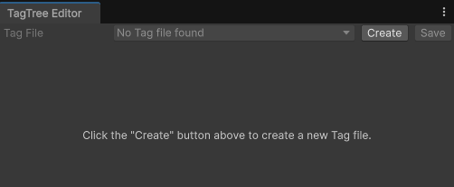
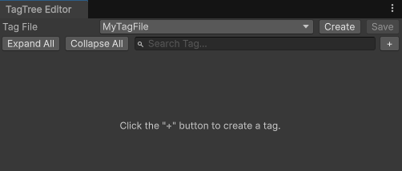
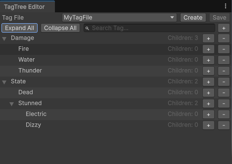
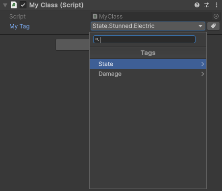
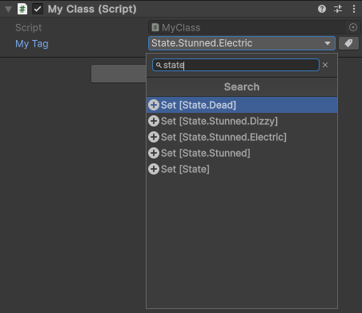
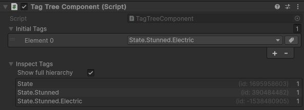

# TagTree

TagTree is an hierarchical Tag System for Unity.

Tags are defined in a tree-like structure, and you can check if an object has a tag on any level of the tree, meaning
that if a character has a tag `State.Stunned.Electric` and you want to check if the character is stunned, you can
simply check for `State.Stunned` instead.

Basically anything can have tags, you just need to create an object of type `TagContainer`, but there's already a built-in extension specifically for GameObjects, so you can just use that straight away!

# Table of Contents

<!-- START doctoc generated TOC please keep comment here to allow auto update -->
<!-- DON'T EDIT THIS SECTION, INSTEAD RE-RUN doctoc TO UPDATE -->


- [Getting Started](#getting-started)
- [Concepts](#concepts)
  - [Tags and TagContainers](#tags-and-tagcontainers)
  - [Creating and loading Tags](#creating-and-loading-tags)
  - [Getting and Adding Tags](#getting-and-adding-tags)
  - [Matching Tags](#matching-tags)
    - [`Matches`](#matches)
    - [`MatchesExact`](#matchesexact)
  - [Tag Stacking](#tag-stacking)
  - [Tag Queries](#tag-queries)
- [GameObjects Extension](#gameobjects-extension)
  - [`TagTreeGOQuery`](#tagtreegoquery)
  - [`TagTreeComponent`](#tagtreecomponent)

<!-- END doctoc generated TOC please keep comment here to allow auto update -->

# Getting Started

First, add the package to your Unity project. When it finishes importing, you can open the TagTree Editor by going to the top bar and selecting `Tools > TagTree Editor`. When you first open it, it'll automatically create a `TagTree_Settings` asset inside your Resources folder.

Next, you need to create your Tags so they can be loaded and configured by the system. To create a new Tag File, just click the `Create` button in the Tag Editor, type the file's name and confirm. This will create a new Tag file in the Resources folder and load it into the editor. After that, you can click the plus (`+`) button to add tags to your file. Don't forget to click `Save` when you're done.




> **NOTE:** Tags needs to be created beforehand and cannot be created during runtime.

Now you just need to add the `DeiveEx.TagTree` namespace to your scripts and you can start using your tags!

```csharp
//Add the Namespace
using DeiveEx.TagTree;

public class MyClass : MonoBehavior
{
    //TagReference shows up in the inspector!
    public TagReference tagFromInspector;

    public void Start()
    {
        //Get a Tag Reference
        Tag tagFromInspector = TagReference.GetTag();
        //or
        Tag tagFromFullname = Tag.GetTagFromFullName("a");

        //Get a TagContainer reference
        TagContainer container = new TagContainer();
        //or
        TagContainer goContainer = this.gameObject.GetTagContainer();

        //Add a Tag to the TagContainer
        container.AddTag(testTag);

        //Check if Tag exists inside a TagContainer
        container.HasTag(testTag); //Outputs true
    }
}
```

> **Tip:** There's also some ***Sample Scenes*** included that explains this package's functionalitites in more details.

> Also, If you just want to add some tags at `Awake()` or have an easy way to inspect tags in a specific GameObject, you can use the included [TagTree Component](#tagtreecomponent).

# Concepts

## Tags and TagContainers

A `Tag` is defined by an hierarchical name following the standard `parent.child.grandchild`. Tags can have as many levels as you want and as many children as you want.

To assign tags to objects, you need a `TagContainer`. TagContainers can store multiple tags and you can use Methods like `HasTag(tag)` to check if a TagContainer contains a specific tag.

## Creating and loading Tags

To create tags, you need to create a text file with the extension `.tags`. You can use the Editor Tool for that or you can create them manually. To open the TagTree Editor, go to the top bar menu and select `Tools > TagTree Editor`, then just click the `Create` button to create a new Tag File. Use the dropdown to choose which Tag file to edit.



By default the system will look/create a text file/folder called `Tags` in your `Resources` folder, but you can choose to load them from the `Streaming Assets` folder instead by changing the Load Source in the TagTree Settings asset (located in your `Resources` folder).

> **NOTE**: Currently, only one Load Source can be used. So if you've configured your Tags to be loaded from the `Resources` folder, Tags inside the `Streaming Assets` folder will NOT be loaded and cannot be used! And vice-versa.

## Getting and Adding Tags

When adding a tag to a TagContainer, the entire hierarchy of the tag will be added to the container. This means that if you add a tag called `a.b.c`, you're actually adding the following tags:

- `a`
- `a.b`
- `a.b.c`

This also means that just by adding the tag `a.b.c`, you can then check if the container has tag `a` or tag `a.b`.

To get a reference to a Tag, the reccomended way is to create a field of type `TagReference`. This type has a custom property drawer that allows you to select a tag from the ones you have defined in your Tag Files.

```csharp
using DeiveEx.TagTree;

public MyClass : MonoBehavior
{
    public TagReference MyTag;
}
```




But you can also get a tag from their Full Name:

```csharp
Tag myTag = Tag.GetTagFromFullName("a.b.c");
```

> **NOTE:** Tag names are case sensitive!

To add a Tag to a TagContainer, just use `AddTag(Tag)`

```csharp
TagContainer container = new TagContainer();
container.AddTag(myTag);
```

## Matching Tags

Tags and TagContainers have methods for "matching" other tags. This means you can check if a certain tag matches another is some way. There's 2 types of "match" methods:

### `Matches`

This method will return True if the tag or any parent tag matches. Note that child tags can match parent tags, but parent tags CANNOT match child tags.

```csharp
bool result = myTag.Matches(otherTag);
```

| SourceTag | Matches | Result |
| --- | --- | --- |
| a.b.c | a.b.c | TRUE |
| a.b.c | a | TRUE |
| a | a.b.c | FALSE |
| a.b.x | a.b.y | FALSE |

### `MatchesExact`

This method will only return True if the tag itself matches.

```csharp
bool result = myTag.MatchesExact(otherTag);
```

| SourceTag | MatchesExact | Result |
| --- | --- | --- |
| a.b.c | a.b.c | TRUE |
| a.b.c | a | FALSE |
| a | a.b.c | FALSE |
| a.b.c | a.b.x | FALSE |

Tags/TagContainers also have methods to match tags inside a TagContainer, like `MatchAny()` and `MatchAll()`.

## Tag Stacking

Tags also have a concept of "stacking", meaning that you can apply the same tag multiple times and an internal counter will go up. For a tag to be fully removed, it needs to be removed by the same amount of times that it was applied, although it is possible to force a full removal of a tag by calling `RemoveTagCompletely()`. Take a look at the example below:

```csharp
Tag a = Tag.GetTagFromFullName("a");
Tag a_b = Tag.GetTagFromFullName("a.b");

container.AddTag(a);
container.AddTag(a_b); //Since the entire hierarchy is added, tag "a" is added again here

Debug.Log(container.GetTagCount(a)) //Outputs 2
Debug.Log(container.GetTagCount(a_b)) //Outputs 1

container.RemoveTag(a_b);

Debug.Log(container.GetTagCount(a)) //Outputs 1
Debug.Log(container.GetTagCount(a_b)) //Outputs 0. This tag is not in the container anymore
```

But what happens if we call `RemoveTag(a)` twice instead? In this case, there's 2 paths we can take.

- If we call `RemoveTag(a)`, this will drop the counter of tag `a` to `1` instead of `0`, because tag `a.b` cannot exist without tag `a`. So as long as the container has any tag that is a child of tag `a`, tag `a` cannot be fully removed.

```csharp
container.AddTag(a);
container.AddTag(a_b); //Tag "a" counter is now 2

container.RemoveTag(a); //Tag "a" counter is now 1
container.RemoveTag(a); //Shows a warning

Debug.Log(container.GetTagCount(a)) //Outputs 1
```
- If we call `RemoveTagCompletely(a)`, this will remove both tag `a` as well as tag `a.b`, no matter their counter. So, in this case, any tags that are a child of `a` inside the container would be also removed.

```csharp
container.AddTag(a);
container.AddTag(a_b);

container.RemoveTagCompletely(a);

Debug.Log(container.GetTagCount(a)) //Outputs 0
Debug.Log(container.GetTagCount(a_b)) //Outputs 0
```

## Tag Queries

If you just want to simply check if a Tag was added to a TagContainer, you should use `HasTag()`, `HasAny()` or `HasAll()`. But when you start adding dozens of Tags to your objects, you might want to find if a container has a specific combination of Tags, and this can become quite complicated by just using these 3 methods.

That's where `TagQuery` enters the scene. It tries to solve this problem by simplifying the process of checking for combinations of tags inside a TagContainer. This works by creating a `TagQuery` object and adding conditions to it, then it checks if a TagContainer matches these conditions. Let's see an example:

```csharp
//First, we create a TagQuery. We need to tell the query how to treat its conditions. In this case, we want any of the conditions to be true.
TagQuery myQuery = new TagQuery(ConditionMatchType.AnyConditionMatches);

//Then, we need to add conditions to the query. Let's add a simple condition that only checks if any of the given Tags exists in the container
Tag tagA = Tag.GetTagFromFullName("a");
Tag tagB = Tag.GetTagFromFullName("b");

var hasAnyTagCondition = new QueryMatchesAny()
{
    TagsToMatch = new List<Tag>() { tagA, tagB }
};

myQuery.AddCondition(hasAnyTagCondition);

//Finally, we use the Query in a TagContainer and check if it matches the conditions
TagContainer testContainer = new TagContainer(tagA);
        
bool containerMatchesQuery = myQuery.Match(testContainer); //This will return "true"
Debug.Log($"Does container matches Query? {containerMatchesQuery}");
```

When creating a TagQuery you need to tell it how to treat the conditions. These are the current available options:
- `AnyConditionMatches`: Returns true if any of the provided conditions matches. If there's no conditions, the query returns false.
- `AllConditionsMatches`: Returns true if all of the provided conditions matches. If there's no conditions, the query returns true since technically no condition has failed.
- `NoConditionsMatch`: Returns true if none of the provided conditions matches. If there's no conditions, the query returns true since tchnically no condition has failed.

Also, the current available conditions are:
- `QueryMatchesAny`: Will check if any of the provided Tags are inside the container. If there's no Tags in the container, returns false.
- `QueryMatchesAll`: Will check if all of the provided Tags are inside the container. If there's no Tags in the container, returns true since technically there's no Tags that failes to match.
- `QueryMatchesNone`: Will check if none of the provide Tags are inside the container. If there's no Tags inside the containers, returns true since technically there's no Tags thaty failed to match.

> **NOTE:** TagQueries uses `MatchesExact` behind the scenes. But remember that adding Tag `a.b` also adds Tag `a` to the container, so even if you're only checking for Tag `a`, the query will still find a match.

The examble above is a very simple example, but the true power of TagQueries comes not only from the fact that you can combine multiple conditions, but also by the fact that you can nest queries inside each other, allowing you to create truly complex queries! Let's see a more complex example:

```csharp
var tag1 = Tag.GetTagFromFullName("1");
var tag2 = Tag.GetTagFromFullName("2");
var tag3 = Tag.GetTagFromFullName("3");
var tag4 = Tag.GetTagFromFullName("4");

//In this example, we want to query if the container has either tag 1 or 3, but not both, and NOT have tag 2. Tag 4 should have no effect in the query
var mainQuery = new TagQuery(ConditionMatchType.AllConditionsMatches);

mainQuery.AddCondition(new QueryMatchesAny()
{
    TagsToMatch = new () { tag1, tag3 }
});

//Create a different query that will be nested inside the first one
var subQuery = new TagQuery(ConditionMatchType.NoConditionsMatch);

subQuery.AddCondition(new QueryMatchesAll()
{
    TagsToMatch = new () { tag1, tag3 }
});

subQuery.AddCondition(new QueryMatchesAny()
{
    TagsToMatch = new () { tag2 }
});
    
//Nest the subQuery inside the mainQuery
mainQuery.AddCondition(subQuery);

//Let's create some containers to test
TagContainer containerA = new TagContainer(tag1);
TagContainer containerB = new TagContainer(tag3, tag4);
TagContainer containerC = new TagContainer(tag1, tag2);
TagContainer containerD = new TagContainer(tag1, tag3);

mainQuery.Match(containerA); //True
mainQuery.Match(containerB); //True
mainQuery.Match(containerC); //False
mainQuery.Match(containerD); //False
```

# GameObjects Extension

This package includes somne extra functionality for Unity's GameObjects. The first one is that you can get a TagContainer through a GameObject reference:

```csharp
public class MyClass : MonoBehavior
{
    public void Start()
    {
        TagContainer goContainer = this.gameObject.GetTagContainer();
    }
}
```

## `TagTreeGOQuery`

Another functionality is that you can use the static class `TagTreeGOQuery` to search for GameObjects with specific Tags:

```csharp
Tag tagA = Tag.GetTagFromFullName("a");
IEnumerable<GameObject> matches = TagTreeGOQuery.GetAllWithTag(tagA);

foreach (GameObject go in matches)
{
    Debug.Log($"GameObject {go.name} has Tag {tagA.FullTagName}")
}
```

There's some other methods inside the `TagTreeGOQuery` class, you can even use a `TagQuery` or a custom condition!

## `TagTreeComponent`

This is a helper component created to allow users to check which Tags are currently assigned to a GameObject's TagContainer. It also allows you to provide some Tags to be added on `Awake()`. It displays the currently added Tags, their ID and how many times each Tag was applied. By default it'll only display Leaf Tags (Tags with no children) to avoid cluttering the Inspector, but you can toggle the display of all Tags.

This component is entirely optional. You don't need it to add Tags to GameObjects.



> **NOTE:** Tags should only be used during Runtine/Play Mode, so the "Inspect Tags" section will only show Tags when you're in Play Mode.