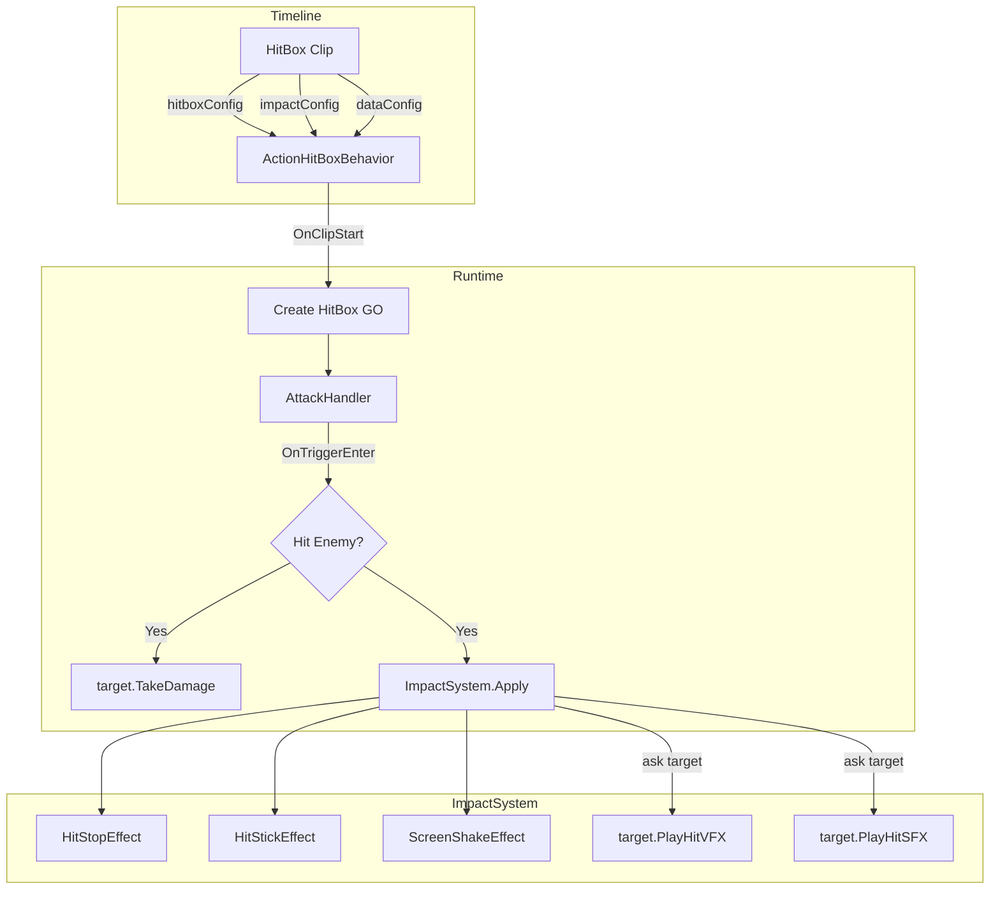

# 打击感系统设计方案

## 核心设计理念

打击感的本质是：**命中瞬间，通过多种感官通道同时给玩家反馈，让攻击"有重量"。**

关键原则：
1. **配置与执行分离** — 配置在 Timeline Clip 上编辑，执行由独立系统负责
2. **ImpactConfig 只管"感觉参数"** — 不持有资源引用（音效、粒子）
3. **资源引用跟着"谁被打"走** — 不同敌人被打的音效/特效不同，这是受击方的属性
4. **直接调用，不绕事件总线** — 同步的打击反馈不需要事件解耦

---

## 架构总览



---

## 配置拆分

### ImpactConfig — 只管"感觉参数"

```csharp
[Serializable]
public class ImpactConfig
{
    [Header("HitStop")]
    public bool EnableHitStop = true;
    [Range(0.01f, 0.5f)]
    public float HitStopDuration = 0.08f;
    [Range(0f, 1f)]
    public float HitStopTimeScale = 0.05f;

    [Header("HitStick")]
    public bool EnableHitStick = false;
    [Range(0.1f, 1f)]
    public float StickStrength = 0.3f;
    [Range(0.01f, 0.5f)]
    public float StickDuration = 0.15f;

    [Header("Screen Shake")]
    public bool EnableScreenShake = false;
    [Range(0f, 2f)]
    public float ShakeIntensity = 0.3f;
    [Range(0.01f, 1f)]
    public float ShakeDuration = 0.2f;
}
```

**移除的内容：**
- `HitSound` / `SoundVolume` / `Sound3D` / `SoundMaxDistance` → 移到受击方
- `HitParticlePrefab` / `SpawnAtHitPoint` / `ParticleScale` / `ParticleLifetime` → 移到受击方
- `OverallIntensity` / `DifferentiateAttackerTarget` / `AttackerIntensity` / `TargetIntensity` → 暂时移除，过度设计
- `WeaponType` / `AttackType` 枚举 → 暂时移除，等真正需要差异化时再加
- 静态预设方法 → 移除，用 ScriptableObject 预设代替

**理由：** ImpactConfig 放在 HitBox Clip 上，设计者在 Timeline 里调的是"这一刀砍下去的手感"。音效和粒子不是手感，是"被砍的东西的反应"。

---

### 受击方配置 — HitFeedbackProfile

```csharp
[CreateAssetMenu(menuName = "Combat/HitFeedbackProfile")]
public class HitFeedbackProfile : ScriptableObject
{
    [Header("Hit Sound")]
    public AudioClip[] hitSounds;       // random pick one
    [Range(0f, 1f)]
    public float volume = 1f;

    [Header("Hit VFX")]
    public GameObject hitVFXPrefab;
    public float vfxScale = 1f;
    public float vfxLifetime = 1f;      // 0 = use prefab default
}
```

**挂在哪里：** 受击方（敌人）身上的组件引用这个 ScriptableObject。

**好处：**
- 木头人被砍 → 木头碎裂音 + 木屑粒子
- 铁甲兵被砍 → 金属撞击音 + 火花粒子
- 史莱姆被砍 → 黏液音 + 液体飞溅粒子
- 同一把剑，不同敌人，不同反馈 — 这才合理

---

## 数据流

### 当前流程的问题

```
ActionHitBoxBehavior
  → 构造 ImpactData（包含 attacker, target, hitPoint, config...）
  → EventCenter.EventTrigger("ImpactEvent", impactData)
  → ImpactSystem 监听事件
  → ApplyImpact()
```

**问题：**
1. 用全局事件总线传递同步的打击反馈，增加了不必要的间接层
2. `ImpactData` 构造时 target 填的是 `hitData.Attacker?.GetComponent<IDamageable>()`（Bug：取的是攻击者自己）
3. 事件字符串 `"ImpactEvent"` 没有类型安全

### 建议的流程

```
AttackHandler.OnTriggerEnter()
  → damageable.TakeDamage(hitData)
  → ImpactSystem.Instance.Apply(attacker, target, hitPoint, impactConfig)
      → HitStopEffect.Execute()
      → HitStickEffect.Execute()
      → ScreenShakeEffect.Execute()
      → target.PlayHitFeedback(hitPoint)   // sound + vfx from target
```

**关键改变：**
1. **直接调用** `ImpactSystem.Instance.Apply()`，不走 EventCenter
2. **target 从 AttackHandler 传入**，因为 `OnTriggerEnter` 里就有 `other`（被击中的对象）
3. **音效和粒子由 target 自己播放**，ImpactSystem 只负责通知

---

## 简化后的 ImpactData

```csharp
public struct ImpactData
{
    public ActorCombater Attacker;
    public GameObject Target;          // the hit object
    public Vector3 HitPoint;
    public float Damage;
    public ImpactConfig Config;
}
```

**移除的内容：**
- `IDamageable Target` → 改为 `GameObject Target`，更通用
- `ImpactForce` → 暂时不需要，等有物理击退时再加
- `WeaponType` / `AttackType` → 暂时不需要

---

## ImpactSystem 简化

```csharp
public class ImpactSystem : MonoBehaviour
{
    public static ImpactSystem Instance { get; private set; }

    void Awake() => Instance = this;

    public void Apply(ImpactData data)
    {
        if (data.Config == null) return;

        // Time effects
        if (data.Config.EnableHitStop)
            ApplyHitStop(data);

        if (data.Config.EnableHitStick)
            ApplyHitStick(data);

        // Screen shake
        if (data.Config.EnableScreenShake)
            ApplyScreenShake(data);

        // Target feedback (sound + vfx)
        var feedback = data.Target?.GetComponent<HitFeedbackReceiver>();
        if (feedback != null)
            feedback.PlayFeedback(data.HitPoint);
    }
}
```

**不再需要：**
- 对象池（效果很轻量，不需要池化纯 C# 对象）
- EventCenter 事件注册/监听
- `EnsureExists()` 自动创建（应该在场景中预先放置）

---

## 调用方改动

### ActionHitBoxBehavior.OnHitStart

```csharp
void OnHitStart(AttackHitData data)
{
    if (ImpactSystem.Instance == null) return;

    ImpactSystem.Instance.Apply(new ImpactData
    {
        Attacker = data.Attacker,
        Target = data.TargetObject,    // from AttackHandler
        HitPoint = data.HitPoint,
        Damage = data.Damage,
        Config = impactConfig
    });
}
```

### AttackHandler — 传递 target 信息

```csharp
// AttackHitData needs target reference
public struct AttackHitData
{
    public float Damage;
    public ActorCombater Attacker;
    public GameObject TargetObject;    // NEW: the hit object
    public Vector3 HitPoint;
}
```

---

## 文件结构

```
Assets/Scripts/
├── Combat/
│   ├── AttackHandler.cs          // collision detection
│   ├── AttackHitData.cs          // hit data struct + AttackDataConfig
│   └── IDamageable.cs            // damage interface
│
├── ImpactSystem/
│   ├── ImpactSystem.cs           // main manager, direct call
│   ├── ImpactConfig.cs           // feel params only (no resources)
│   └── Effects/
│       ├── HitStopEffect.cs      // Time.timeScale
│       ├── HitStickEffect.cs     // ActionPlayer.SetSpeed
│       └── ScreenShakeEffect.cs  // camera shake
│
├── Combat/
│   ├── HitFeedbackProfile.cs     // ScriptableObject: sound + vfx
│   └── HitFeedbackReceiver.cs    // MonoBehaviour on target: plays feedback
│
└── TimelinePlayable/
    └── HitBox/
        ├── ActionHitBoxBehavior.cs
        └── ActionHitBoxClip.cs
```

---

## 与当前系统的对比

| 方面 | 当前系统 | 建议方案 |
|------|---------|---------|
| 配置位置 | ImpactConfig 包含音效/粒子引用 | ImpactConfig 只有感觉参数 |
| 音效/粒子 | 攻击方配置 | 受击方配置（HitFeedbackProfile） |
| 调用方式 | EventCenter 事件总线 | 直接调用 ImpactSystem.Instance.Apply() |
| target 引用 | Bug：取的是攻击者自己 | 从 AttackHandler 正确传入 |
| 对象池 | 有，但不必要 | 移除，效果对象很轻量 |
| ImpactData | class，字段很多 | struct，只保留必要字段 |
| 效果管理 | activeEffects 列表 + Update 轮询 | 协程或简单计时器 |

---

## 实施优先级

| 优先级 | 任务 | 理由 |
|--------|------|------|
| P0 | 修复 target Bug | 当前 target 取的是攻击者自己 |
| P0 | ImpactConfig 移除音效/粒子字段 | 减少困惑 |
| P1 | 直接调用替代 EventCenter | 简化流程 |
| P1 | AttackHitData 加入 TargetObject | 正确传递目标 |
| P2 | 创建 HitFeedbackProfile + Receiver | 受击方反馈 |
| P2 | 实现 ScreenShakeEffect | 补全功能 |
| P3 | 移除对象池 | 简化代码 |

---

## 总结

核心思想就三点：
1. **ImpactConfig = 手感参数**（时间停顿、动作黏滞、屏幕震动的数值）
2. **音效和粒子跟着被打的人走**（不同敌人不同反馈）
3. **直接调用，不绕弯路**（不需要事件总线来传递同步反馈）
