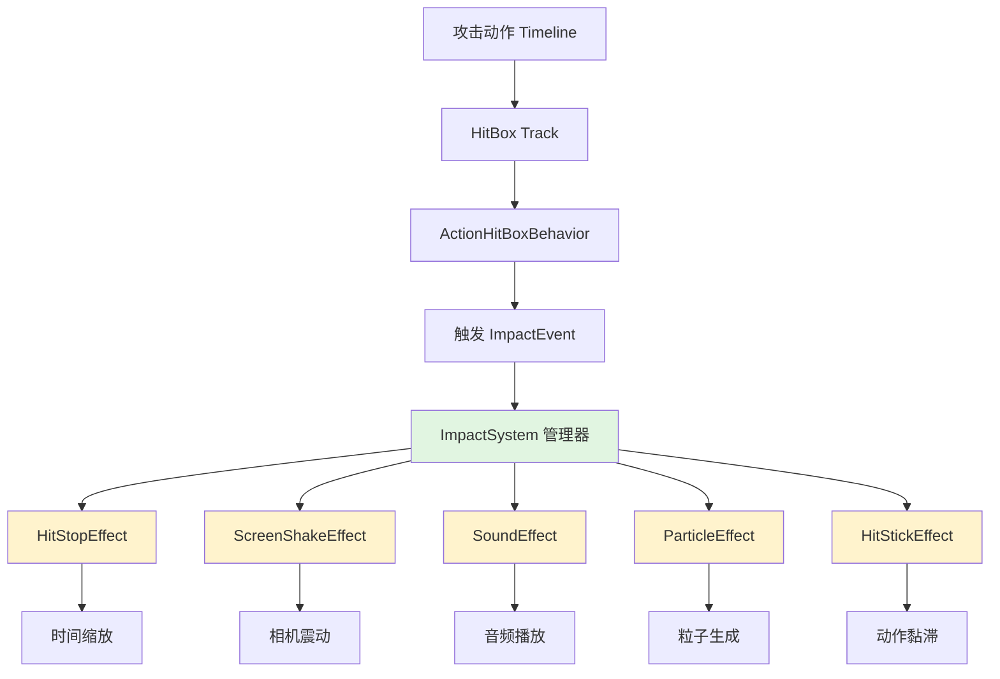

# ACT游戏打击感系统重构方案

## 概述

本方案旨在重构当前不完整的打击感系统，实现类似《鬼泣》、《Sifu》等高品质ACT游戏的打击感体验。通过模块化、可扩展的架构设计，支持多种打击效果（时间停顿、屏幕震动、音效、特效等），并与现有Timeline Playable系统无缝集成。

## 设计目标

1. **架构清晰**：解耦打击感逻辑与游戏逻辑
2. **扩展性强**：支持轻松添加新的打击效果类型
3. **配置灵活**：设计师可通过Timeline直观配置打击感参数
4. **性能高效**：适合ACT游戏高频打击场景
5. **渐进增强**：分阶段实现，优先实现核心功能（时间停顿）

## 系统架构



## 核心类设计

### 1. ImpactData（打击数据）

```csharp
public struct ImpactData
{
    public ActorCombater Attacker;      // 攻击者
    public IDamageable Target;          // 受击者
    public Vector3 HitPoint;           // 击中点
    public float Damage;               // 伤害值
    public float ImpactForce;          // 打击力度
    public ImpactConfig Config;        // 打击配置
    public WeaponType WeaponType;      // 武器类型
    public AttackType AttackType;      // 攻击类型
}
```

### 2. ImpactConfig（打击配置）

```csharp
[Serializable]
public class ImpactConfig
{
    // 时间效果
    public bool EnableHitStop = true;
    public float HitStopDuration = 0.08f;
    public float HitStopTimeScale = 0.05f;
    
    // 屏幕震动
    public bool EnableScreenShake = true;
    public float ShakeIntensity = 0.3f;
    public float ShakeFrequency = 20f;
    public float ShakeDuration = 0.2f;
    
    // 音效
    public AudioClip HitSound;
    public float SoundVolume = 1.0f;
    
    // 特效
    public GameObject HitParticlePrefab;
    public bool SpawnAtHitPoint = true;
    
    // 动作黏滞
    public bool EnableHitStick = false;
    public float StickStrength = 0.3f;
    public float StickDuration = 0.15f;
}
```

### 3. ImpactSystem（打击系统管理器）

```csharp
public class ImpactSystem : MonoBehaviour
{
    public static ImpactSystem Instance { get; private set; }
    
    private List<ImpactEffect> activeEffects = new List<ImpactEffect>();
    private Dictionary<Type, ImpactEffect> effectPool = new Dictionary<Type, ImpactEffect>();
    
    void Awake()
    {
        if (Instance == null)
        {
            Instance = this;
            DontDestroyOnLoad(gameObject);
        }
    }
    
    // 触发打击效果
    public void ApplyImpact(ImpactData impactData)
    {
        // 根据配置创建并执行效果
        if (impactData.Config.EnableHitStop)
        {
            GetEffect<HitStopEffect>().Execute(impactData);
        }
        
        if (impactData.Config.EnableScreenShake)
        {
            GetEffect<ScreenShakeEffect>().Execute(impactData);
        }
        
        // ... 其他效果
    }
    
    private T GetEffect<T>() where T : ImpactEffect, new()
    {
        // 对象池实现
    }
    
    void Update()
    {
        // 更新所有活跃效果
        for (int i = activeEffects.Count - 1; i >= 0; i--)
        {
            if (!activeEffects[i].Update())
            {
                // 效果结束，回收
                effectPool[activeEffects[i].GetType()] = activeEffects[i];
                activeEffects.RemoveAt(i);
            }
        }
    }
}
```

### 4. ImpactEffect（打击效果基类）

```csharp
public abstract class ImpactEffect
{
    public abstract void Execute(ImpactData impactData);
    public abstract bool Update(); // 返回false表示效果结束
    public abstract void Reset();
}
```

### 5. 具体效果实现

#### HitStopEffect（时间停顿效果）
```csharp
public class HitStopEffect : ImpactEffect
{
    private float timer;
    private float originalTimeScale;
    private float targetTimeScale;
    private float duration;
    
    public override void Execute(ImpactData impactData)
    {
        duration = impactData.Config.HitStopDuration;
        targetTimeScale = impactData.Config.HitStopTimeScale;
        originalTimeScale = Time.timeScale;
        
        Time.timeScale = targetTimeScale;
        timer = duration;
    }
    
    public override bool Update()
    {
        timer -= Time.unscaledDeltaTime;
        if (timer <= 0)
        {
            Time.timeScale = originalTimeScale;
            return false;
        }
        return true;
    }
}
```

#### ScreenShakeEffect（屏幕震动效果）
```csharp
public class ScreenShakeEffect : ImpactEffect
{
    private float duration;
    private float intensity;
    private float frequency;
    private Vector3 originalPosition;
    private Transform cameraTransform;
    private float seed;
    
    public override void Execute(ImpactData impactData)
    {
        // 获取主相机
        cameraTransform = Camera.main.transform;
        originalPosition = cameraTransform.localPosition;
        
        duration = impactData.Config.ShakeDuration;
        intensity = impactData.Config.ShakeIntensity;
        frequency = impactData.Config.ShakeFrequency;
        seed = Random.Range(0f, 100f);
    }
    
    public override bool Update()
    {
        duration -= Time.deltaTime;
        if (duration <= 0)
        {
            cameraTransform.localPosition = originalPosition;
            return false;
        }
        
        // Perlin噪声生成震动
        float shake = Mathf.PerlinNoise(seed + Time.time * frequency, seed) * 2 - 1;
        cameraTransform.localPosition = originalPosition + 
            cameraTransform.right * (shake * intensity);
            
        return true;
    }
}
```

## 与现有系统集成

### 1. 修改 AttackHandler.cs

```csharp
private void OnTriggerEnter(Collider other)
{
    if (((1 << other.gameObject.layer) & config.targetLayers) != 0)
    {
        if(attackedObjects.Contains(other)) return;

        if (other.TryGetComponent<IDamageable>(out var damageable))
        {
            // 原有伤害逻辑
            AttackHitData hitData = new AttackHitData(...);
            damageable.TakeDamage(hitData);
            
            // 新增打击感触发
            ImpactData impactData = new ImpactData
            {
                Attacker = combater,
                Target = damageable,
                HitPoint = other.ClosestPoint(transform.position),
                Damage = config._baseDamage,
                ImpactForce = CalculateImpactForce(),
                Config = GetImpactConfig(), // 从AttackDataConfig获取
                WeaponType = GetWeaponType(),
                AttackType = GetAttackType()
            };
            
            // 触发打击效果
            ImpactSystem.Instance.ApplyImpact(impactData);
            
            attackedObjects.Add(other);
        }
    }
}
```

### 2. 扩展 AttackDataConfig

```csharp
[Serializable]
public class AttackDataConfig
{
    public LayerMask targetLayers = 1 << 8;
    public float _baseDamage = 10f;
    
    // 新增打击感配置
    public ImpactConfig ImpactConfig = new ImpactConfig();
    
    // 武器类型和攻击类型（用于差异化打击感）
    public WeaponType WeaponType = WeaponType.Sword;
    public AttackType AttackType = AttackType.Light;
}
```

### 3. 在Timeline中配置

保持现有的ActionHitBoxClip结构，但将AttackImpactConfig替换为更完整的ImpactConfig：

```csharp
public class ActionHitBoxClip : PlayableAsset, ITimelineClipAsset
{
    public ExposedReference<Transform> boneTransform;
    public ActionHitBoxConfig hitboxConfig = new ActionHitBoxConfig();
    public AttackDataConfig dataConfig = new AttackDataConfig(); // 包含ImpactConfig
    
    // ... 原有代码
}
```

## 实现步骤（分阶段）

### 阶段1：核心架构与时间停顿（1-2天）
1. 创建ImpactSystem单例管理器
2. 实现ImpactData、ImpactConfig数据结构
3. 实现HitStopEffect时间停顿效果
4. 修改AttackHandler触发打击感系统
5. 基础测试验证

### 阶段2：视觉与音频反馈（2-3天）
6. 实现ScreenShakeEffect屏幕震动
7. 实现SoundEffect音效播放
8. 实现ParticleEffect粒子生成
9. 集成现有特效系统（EffectControlBehaviour）

### 阶段3：高级功能与优化（2-3天）
10. 实现HitStickEffect动作黏滞
11. 添加相机震动（区别于屏幕震动）
12. 实现差异化打击感（基于武器/攻击类型）
13. 性能优化（对象池、缓存）

### 阶段4：工具链与配置（1-2天）
14. 创建Timeline自定义编辑器
15. 实现ImpactConfig可视化配置
16. 添加预设系统（轻攻击/重攻击预设）

## 关键技术点

### 1. 时间停顿实现
- 使用`Time.timeScale`控制全局时间（影响所有物体）
- 配合`Time.unscaledDeltaTime`更新效果计时器
- 注意与UI动画的兼容性

### 2. 屏幕震动算法
- 基于Perlin噪声生成自然震动
- 支持强度、频率、持续时间参数
- 多震动源叠加处理

### 3. 对象池管理
- ImpactEffect对象池减少GC
- 粒子系统对象池重用
- 音频源对象池管理

### 4. 差异化打击感
- 根据武器类型（剑、拳、枪）调整参数
- 根据攻击类型（轻击、重击、特殊技）调整参数
- 根据打击部位（头部、躯干、四肢）调整参数

## 预期效果

1. **打击感显著增强**：时间停顿+屏幕震动+音效+特效的综合反馈
2. **配置灵活性**：设计师可在Timeline中精细调整每个攻击的打击感
3. **性能可控**：对象池和高效算法确保高频打击下的性能
4. **扩展便捷**：新增打击效果只需继承ImpactEffect并实现两个方法

## 风险评估与应对

| 风险 | 可能性 | 影响 | 应对措施 |
|------|--------|------|----------|
| 时间缩放影响其他系统 | 中 | 高 | 使用Time.timeScale前备份原值，结束后恢复 |
| 多震动源冲突 | 高 | 中 | 实现震动叠加算法，限制最大强度 |
| GC性能问题 | 中 | 中 | 使用对象池，避免每帧分配 |
| 与现有动画系统冲突 | 低 | 高 | 测试与Animancer的兼容性，必要时调整 |

## 后续扩展方向

1. **受击动画系统**：集成Animancer状态机，实现受击、硬直、浮空等状态
2. **打击力度反馈**：基于物理的击退、击飞效果
3. **连击系统集成**：连击数影响打击感强度
4. **动态难度调整**：根据玩家表现动态调整打击感参数

---

## 下一步行动

1. 评审本方案，确认技术可行性
2. 切换到Code模式开始实现阶段1
3. 建立测试场景验证核心功能
4. 迭代完善各阶段功能